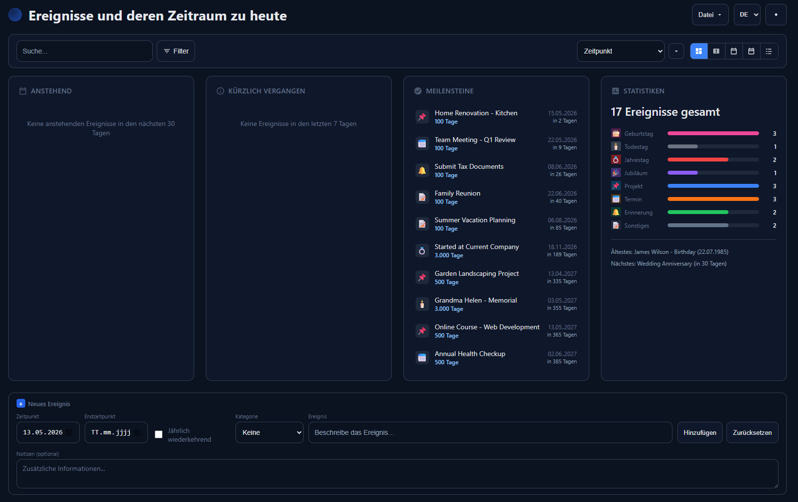
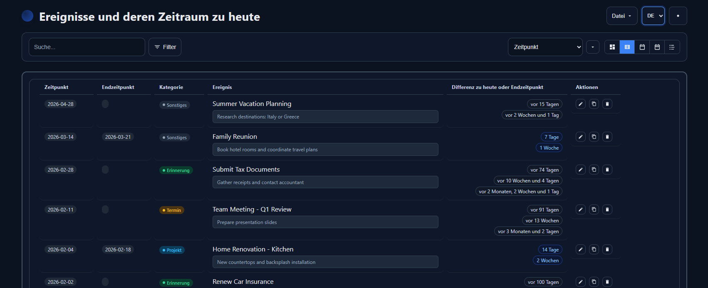
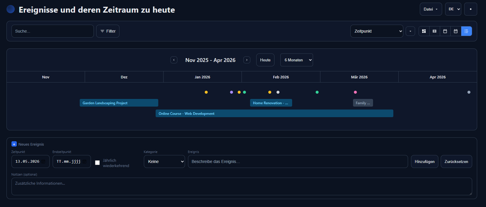

# Ereignisse

> Lokale Web-Anwendung zur Verwaltung von Ereignissen mit automatischer Berechnung der Zeitdifferenz zum aktuellen Datum

**Online-Demo:** [matthiasscg.github.io/MHS-Ereignisse/Ereignisse.html](https://matthiasscg.github.io/MHS-Ereignisse/Ereignisse.html)

> Hinweis zur Demo: Die Daten werden im LocalStorage des Browsers unter der Demo-Domain gespeichert. Sie sind weder mit einer lokalen Installation noch mit anderen Geräten synchron. Für persistente Nutzung wird empfohlen, die `Ereignisse.html` herunterzuladen und lokal zu speichern, da der Browser-LocalStorage jederzeit (z. B. durch Cache-Reinigung) gelöscht werden kann.

## Screenshots

### Dashboard

Überblick über anstehende und kürzlich vergangene Ereignisse, Meilensteine sowie Statistiken nach Kategorie.



### Tabellenansicht

Detaillierte Verwaltung mit Zeitpunkt, optionalem Endzeitpunkt, Kategorie und automatisch berechneter Differenz zum aktuellen Datum (in Tagen, Wochen und Monaten).



### Timeline

Zeitlich gestaffelte Darstellung von Ereignissen und Zeitspannen über Monate hinweg.



## Features

- **Ereignisverwaltung** – Hinzufügen, Bearbeiten, Duplizieren und Löschen
- **Zeitberechnung** – Automatische Anzeige in Tagen, Wochen, Monaten und Jahren
- **Zeitspannen** – Unterstützung von Start- und Endzeitpunkt
- **Meilensteine** – Visuelle Hervorhebung bei runden Zahlen (1000 Tage, 100 Wochen, etc.)
- **Kategorien** – Farbcodierte Tags mit Filterfunktion
- **Notizen** – Mehrzeilige Notizen pro Ereignis
- **Verknüpfungen** – Vorgänger/Nachfolger-Beziehungen zwischen Ereignissen
- **Datenpersistenz** – LocalStorage + JSON-Export/Import
- **Dark Mode** – Automatisch oder manuell umschaltbar
- **Mehrsprachig** – DE, EN, FR, IT, ES (mit Browser-Erkennung)

## Verwendung

1. `Ereignisse.html` im Browser öffnen
2. Ereignisse über das Formular hinzufügen
3. Daten werden automatisch im Browser gespeichert

**Empfohlene Browser:** Chrome oder Edge (für volle File System API Unterstützung)

## Tastaturkürzel

| Kürzel | Aktion |
|--------|--------|
| `Ctrl + S` | Speichern |
| `Ctrl + Shift + S` | Speichern unter... |
| `Ctrl + O` | Datei öffnen |
| `Ctrl + Enter` | Ereignis hinzufügen (im Textfeld) |

## Browser-Kompatibilität

| Browser | File System API | Fallback |
|---------|-----------------|----------|
| Chrome 86+ | ✅ | – |
| Edge 86+ | ✅ | – |
| Firefox | ❌ | ✅ Download/Upload |
| Safari | ❌ | ✅ Download/Upload |

## Build

Die Anwendung wird modular unter `Quellcode/src/` gepflegt (CSS, JS, i18n, Icons) und per Build-Skript zu einer einzigen, autarken `Ereignisse.html` gebündelt.

```bash
python Quellcode/build.py
```

Voraussetzung: Python 3 (keine weiteren Abhängigkeiten). Das Build-Skript liest `Quellcode/src/template.html` und ersetzt die Marker durch die jeweiligen Inhalte (Quelltext bzw. base64-Data-URLs für Icons).

**Hinweis:** Direktes Editieren der `Ereignisse.html` ist nicht vorgesehen, Änderungen erfolgen ausschließlich am Quellcode unter `Quellcode/src/`.

## Dokumentation

- Architektur und technische Details: [PROJEKT.md](PROJEKT.md)
- Änderungshistorie: [CHANGELOG.md](CHANGELOG.md)

## Lizenz

[MIT-Lizenz](LICENSE) — Nutzung, Modifikation und Weiterverbreitung sind unter Einhaltung der Lizenzbedingungen erlaubt.

---

*Version 1.17 · Entwickelt von Matthias Stumm*
